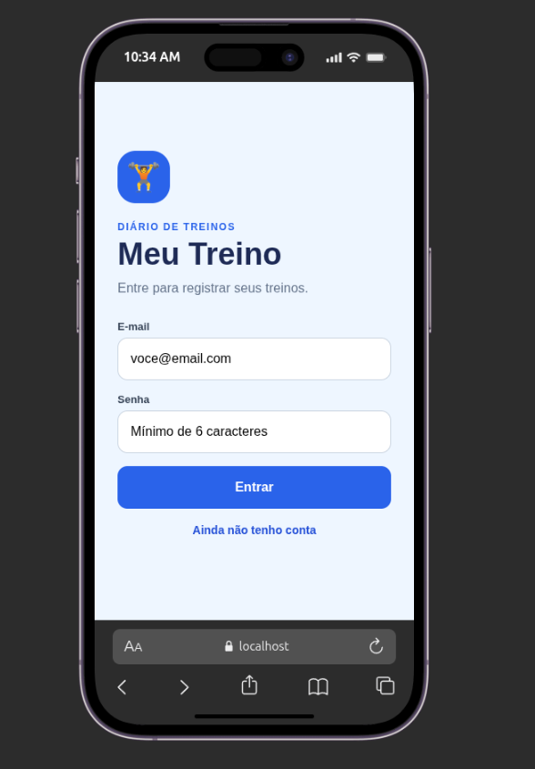
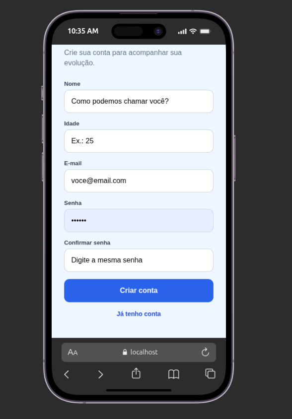
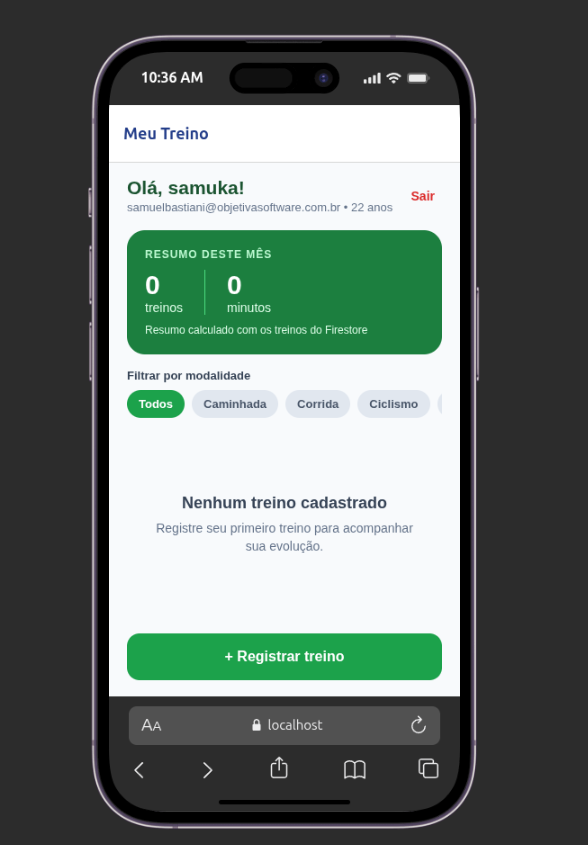
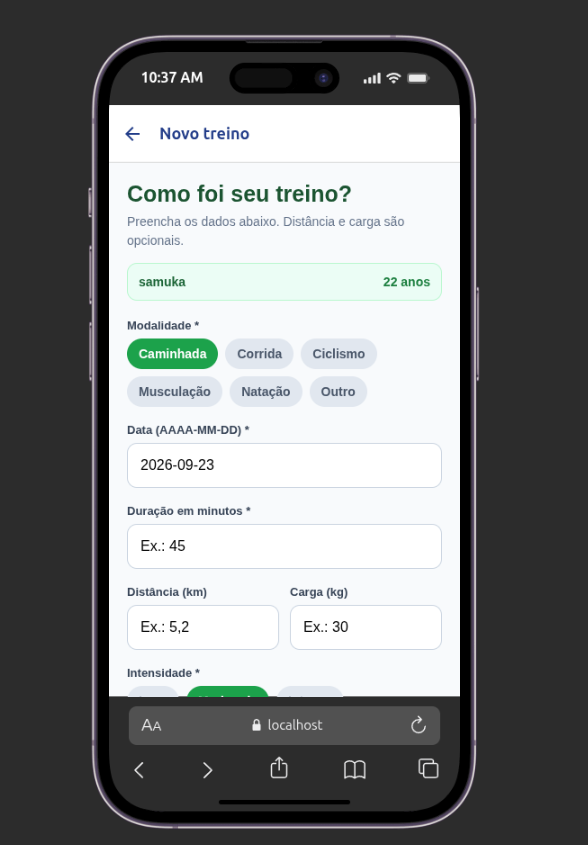
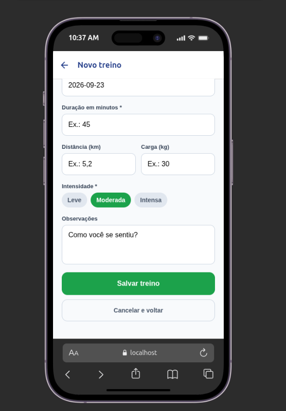
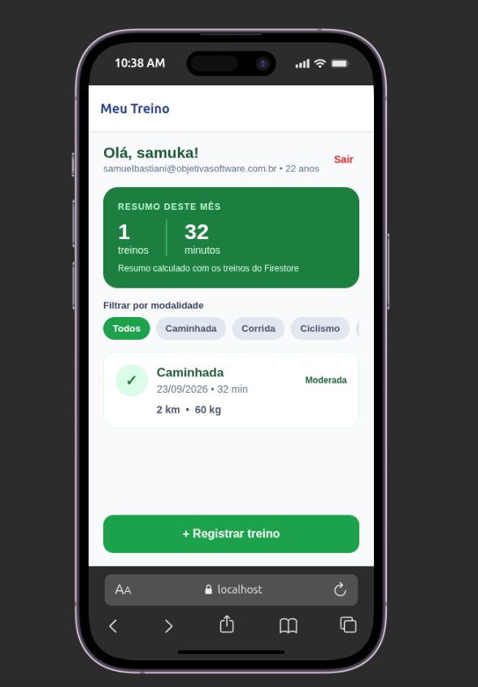
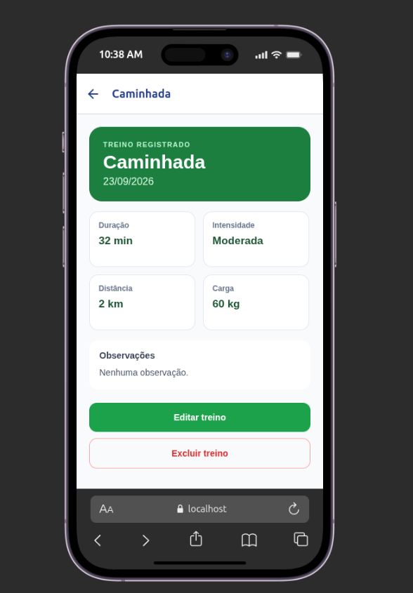

# Meu Treino — Diário de Treinos

Trabalho final da disciplina **Desafio de Desenvolvimento Mobile**.

O Meu Treino é um aplicativo simples para registrar atividades físicas e acompanhar a frequência de exercícios. Cada pessoa cria sua própria conta e enxerga somente os treinos que cadastrou.

## Por que escolhi esse tema?

Me identifico profundamente com a necessidade de me concectar com a prática de esporte, desse modo me propus a fazer essa aplicação

## Funcionalidades

- criação de conta com nome, idade e confirmação de senha, login e logout com Firebase Authentication;
- confirmação antes de encerrar a sessão;
- verificação da sessão antes de exibir as telas internas;
- cadastro, listagem, detalhes, edição e exclusão de treinos;
- confirmação antes de excluir;
- filtro por modalidade e mensagem quando nenhum resultado é encontrado;
- carregamento, mensagens de erro e estado vazio;
- resumo do mês com quantidade de treinos e total de minutos;
- separação dos dados por usuário;
- persistência no Cloud Firestore e da sessão no dispositivo.

## Modelo de dados

O perfil fica em `users/{uid}` e contém:

| Campo       | Tipo           | Exemplo                   |
| ----------- | -------------- | ------------------------- |
| `name`      | texto          | `Ana`                     |
| `age`       | número inteiro | `25`                      |
| `createdAt` | timestamp      | data criada pelo servidor |

Cada documento em `users/{uid}/workouts/{workoutId}` possui:

| Campo             | Tipo                        | Exemplo                   |
| ----------------- | --------------------------- | ------------------------- |
| `activity`        | texto                       | `Corrida`                 |
| `date`            | texto no formato AAAA-MM-DD | `2026-09-22`              |
| `durationMinutes` | número                      | `45`                      |
| `distanceKm`      | número                      | `5.2`                     |
| `loadKg`          | número                      | `0`                       |
| `intensity`       | texto                       | `Moderada`                |
| `notes`           | texto                       | `Treino no parque`        |
| `createdAt`       | timestamp                   | data criada pelo servidor |

Distância e carga são opcionais na tela e são armazenadas como zero quando não informadas.

## Regra de negócio

A duração deve ser maior que zero. Distância e carga nunca podem ser negativas. Essas validações acontecem no formulário e também nas regras do Firestore.

Na tela inicial, o app usa somente os registros do mês atual vindos do Firestore para calcular:

- quantidade de treinos realizados;
- total de minutos treinados.

Assim, o resumo continua correto depois de fechar e abrir o aplicativo.

## Tecnologias e organização

- React Native, Expo e TypeScript;
- Expo Router para navegação e proteção das telas;
- Firebase Authentication;
- Cloud Firestore;
- AsyncStorage para persistência da sessão no React Native.

As telas ficam em `src/app`, os componentes reutilizáveis em `src/components`, os acessos ao Firebase em `src/services`, o estado de autenticação em `src/context` e os tipos em `src/types`.

## Configuração do Firebase

1. Crie um projeto no [Firebase Console](https://console.firebase.google.com/).
2. Em **Authentication > Sign-in method**, habilite **E-mail/senha**.
3. Em **Firestore Database**, crie o banco no modo de produção.
4. Nas configurações do projeto, adicione um aplicativo Web e copie os dados exibidos.
5. Copie `.env.example` para `.env` e substitua os valores:

```bash
cp .env.example .env
```

```env
EXPO_PUBLIC_FIREBASE_API_KEY=sua_api_key
EXPO_PUBLIC_FIREBASE_AUTH_DOMAIN=seu-projeto.firebaseapp.com
EXPO_PUBLIC_FIREBASE_PROJECT_ID=seu-project-id
EXPO_PUBLIC_FIREBASE_STORAGE_BUCKET=seu-projeto.firebasestorage.app
EXPO_PUBLIC_FIREBASE_MESSAGING_SENDER_ID=seu_sender_id
EXPO_PUBLIC_FIREBASE_APP_ID=seu_app_id
```

O arquivo `.env` não deve ser enviado ao GitHub. As chaves públicas de configuração identificam o app, enquanto a proteção real dos dados é feita pelas regras do Firestore. Nunca inclua uma chave de conta de serviço no aplicativo.

## Regras de segurança

O arquivo [`firestore.rules`](firestore.rules) está incluído no projeto. O perfil e a coleção de treinos usam o `uid` no caminho, e as regras comparam esse valor com `request.auth.uid`. Portanto, a conta B não consegue ler ou alterar o perfil nem os treinos da conta A, mesmo tentando acessar o banco fora da interface.

Para publicar pelo terminal:

```bash
npx firebase-tools login
npx firebase-tools use SEU_PROJECT_ID
npx firebase-tools deploy --only firestore:rules
```

Também é possível copiar o conteúdo de `firestore.rules` em **Firestore Database > Rules** e clicar em **Publicar**.

## Instalação e execução

Requisitos: Node.js 22 ou superior, npm e Expo Go no celular.

```bash
npm install
npm run typecheck
npx expo start -c
```

Escaneie o QR Code com o Expo Go. Computador e celular devem estar na mesma rede. Para abrir no navegador, execute `npm run web`.

## Teste sugerido antes da entrega

1. Abra o app sem sessão e confira que somente o login aparece.
2. Crie a conta A e cadastre dois treinos.
3. Abra um treino, edite e confira a atualização.
4. Use o filtro e teste um filtro sem resultados.
5. Feche e abra o app para verificar sessão e dados.
6. Saia, crie a conta B e confirme que ela começa sem treinos.
7. Volte para a conta A e exclua um registro, confirmando o aviso.
8. Tente salvar duração zero ou distância negativa e confira a validação.

## Capturas de tela

<table>
  <tr>
    <td align="center"><strong>Login</strong><br></td>
    <td align="center"><strong>Criação de conta</strong><br></td>
    <td align="center"><strong>Lista vazia</strong><br></td>
  </tr>
  <tr>
    <td align="center"><strong>Novo treino - início</strong><br></td>
    <td align="center"><strong>Novo treino - conclusão</strong><br></td>
    <td align="center"><strong>Resumo mensal</strong><br></td>
  </tr>
  <tr>
    <td align="center"><strong>Detalhes do treino</strong><br></td>
  </tr>
</table>

## Roteiro de apresentação (8 a 10 minutos)

1. **Problema e proposta (1 min):** explicar que o app ajuda a manter um histórico simples de atividades físicas.
2. **Conta e proteção (1 min):** criar ou entrar em uma conta e mostrar que as telas internas não aparecem sem sessão.
3. **CRUD (3 min):** cadastrar, abrir, editar e excluir um treino.
4. **Filtro e regra de negócio (1 min):** filtrar uma modalidade e mostrar o resumo mensal; tentar cadastrar um valor inválido.
5. **Persistência e duas contas (1 min):** mostrar que os dados continuam após reiniciar e que outra conta não os enxerga.
6. **Código e segurança (2 min):** apresentar rapidamente `src/services`, os tipos TypeScript, o card reutilizável e `firestore.rules`.

## Principais pontos para explicar

- O Firebase Authentication informa quem é o usuário atual.
- O `uid` do usuário faz parte do caminho de cada treino no Firestore.
- As regras do Firestore são a segurança real; o filtro da interface serve apenas para usabilidade.
- O listener em tempo real atualiza a `FlatList` após criar, editar ou excluir.
- O resumo mensal é calculado com os dados persistidos, não com valores fixos.
